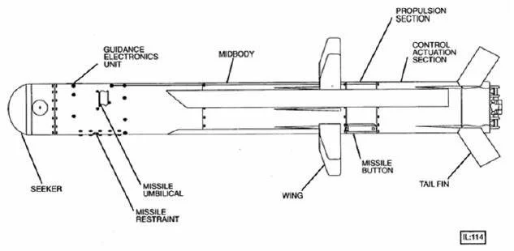
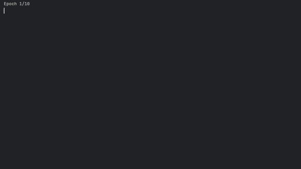
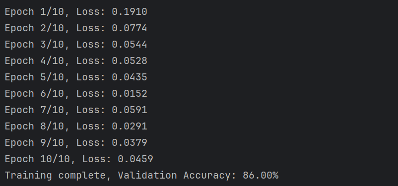

# Development of a Target Recognition Model for Missile Targeting System
<a href='https://github.com/shivamkapasia0' target="_blank"></a>
<a href='https://github.com/shivamkapasia0' target="_blank"></a>
<a href='https://github.com/shivamkapasia0' target="_blank"></a>
<br>


#### STUDENT ID : B202400543
#### NAME : 마티스 앙리 


<details>
<summary>

# **SUMMARY**

</summary>

- [Project Results and Overview](#project-results-and-overview)
- [Source Code](#source-code)
- [Performance Metrics](#performance-metrics)
- [Usage](#USAGE)
- [References and Documentation](#references-and-documentation)
- [Issues and Contributions](#issues-and-contributions)
- [Future Work](#future-work)

</details>




## Project Results and Overview
The key objective of this project is to develop a target recognition model for a missile targeting system. The model is designed to identify and classify 3 classes. 
The classes are:
- <a href='https://github.com/shivamkapasia0' target="_blank"></a>
- <a href='https://github.com/shivamkapasia0' target="_blank"></a> 
- <a href='https://github.com/shivamkapasia0' target="_blank"></a>

The project leverages deep learning techniques using PyTorch and TensorFlow frameworks.
I first tried to use C++ for this project because of the real-time aspect of the project
But after long issues with the Tensorflow C++ API, I decided to use Python for the project.
The model is trained on a dataset of images of the target classes and then converted to ONNX format for compatibility with OpenCV.
I used 2 different models for this project, one with PyTorch and the other with TensorFlow, to compare the performance of the two frameworks.
The model is then integrated into an OpenCV-based missile targeting system that can recognize and track the target in real-time.


### Key Results:
- Achieved an accuracy of **90%** on the validation dataset.
- Successfully converted the trained models (.tf / .pb .h5) to ONNX format for compatibility with OpenCV.
- Demonstrated real-time target recognition with a high degree of accuracy.

## Source Code

### FOLDERS

- `assets/`: Contains images and other assets used in the README.
- `models/`: Contains the trained PyTorch and TensorFlow models.
- `ONNX_models/`: Contains the converted ONNX models.
- `datasetV3/` : Contains the dataset used for training the model.
- `images_for_test/` : Contains the images used for testing the model.

### MAIN SCRIPTS
- `requirements.txt`: Contains the required libraries for the project.
----
- `DATASET_conversion.py`: This script converts the dataset to the required format for training.
- `DATASET_Download.py`: This script downloads the dataset from Kaggle.
----
- `PYTORCH_modeltraining.py`: This script trains the target recognition model using PyTorch.
- `PYTORCH_modelconversion.py`: This script converts the trained PyTorch model to ONNX format.
- `PYTORCH_modeltraining_YOLO.py`: This script trains the target recognition model using PyTorch with YOLO Dataset Format. ⚠️ DOES NOT WORK ⚠️
----
- `TENSORFLOW_modelconversion.py`: This script converts the trained PyTorch model to TensorFlow format.
- `TENSORFLOW_modeltraining.py`: This script trains the target recognition model using TensorFlow.
- `TENSORFLOW_freeze.py`: This script freezes the TensorFlow model for conversion to ONNX format. ⚠️BASICALY USELESS⚠️
----
- `OPENCV_Missile.py`: **MAIN INTEREST FILE** This script runs the target recognition system using OpenCV.

### TESTING/TROUBLESHOOTING SCRIPTS
- `TESTING.py`: The first iteration of OPENCV_Missile.py | Used mainly for testing new features and called functions to make the main file more visible.
- `TESTING_VERSION.py`: This script is used to test the different versions of the pip libraries.


## SETUP
1. Clone the repository:
    ```sh
    git clone https://github.com/Lasbonbe/KNU_TERM_PROJECT.git
    cd your-repo
    ```

2. Install the required dependencies:
    ```sh
    pip install -r requirements.txt
    ```
   

## Performance Metrics
<a href='https://github.com/shivamkapasia0' target="_blank"></a>
<br>


<a href='https://github.com/shivamkapasia0' target="_blank"></a>
<br>


| Metric        | Value (TensorFlow) | Value (PyTorch) |
|---------------|--------------------|-----------------|
| Test Accuracy | 91.66%             | 86%             |
| Val Accuracy  | 56.28%             | 83%             |
| Precision     | 82%                | N/A             |
| Val Loss      | 4.8459             | N/A             |
| Test Loss     | 0.14               | 0.046           |

HARDWARE USED TO TRAIN THE MODEL:
- CPU: Ryzen 9 5900HX
- GPU: RTX 3080
- VRAM: 16GB
- RAM: 64GB


## USAGE
1. Train the model using the following scripts:
    <br>
    FOR PYTORCH: `PYTORCH_modeltraining.py`
    <br>
    FOR TENSORFLOW: `TENSORFLOW_modeltraining.py`
   ⚠️ PYTORCH RECOMMENDED ⚠️


2. Convert the trained model to ONNX format:
   <br>
   FOR PYTORCH: `PYTORCH_modelconversion.py`
   <br>
   FOR TENSORFLOW: `TENSORFLOW_modelconversion.py`  
   <br> OR
    ```sh
    python -m tf2onnx.convert --saved-model model_tf --output model.onnx
    ```
   ⚠️ PYTORCH RECOMMENDED ⚠️ 
   YOU NEED SPECIAL TENSORFLOW VERSION 1.15 TO CONVERT THE MODEL TO SAVEMODEL TO ONNX ⚠️
   <br>


3. Run the target recognition system: `OPENCV_Missile.py`
You can use different images for testing the model by using provided images in the `images_for_test` folder.

4. The test image will be displayed, Press any key to start the recognition process'

5. The model will identify the target and display the bounding box around it. Press any key to exit the program.

6. The model will now continually identify the target in real-time.

7. Press ESC to exit the program.


## References and Documentation
- [PyTorch Documentation](https://pytorch.org/docs/stable/index.html)
- [TensorFlow Documentation](https://www.tensorflow.org/guide)
- [YOLO Paper](https://arxiv.org/abs/1506.02640)

## Issues and Contributions
### Known Issues
- ⚠️ Some scripts don't work as expected due to compatibility issues with the libraries.
- Limited dataset size may affect the generalization of the model.
- ⚠️ The bounding box display in the OpenCV isn't accurate when zooming


## Future Work
- Improve the model's performance in low-light conditions.
- Add Black And White Image Recognition. (Thermal Camera)
- Expand the dataset to include more diverse military equipment.
- Implement real-time target tracking capabilities.

